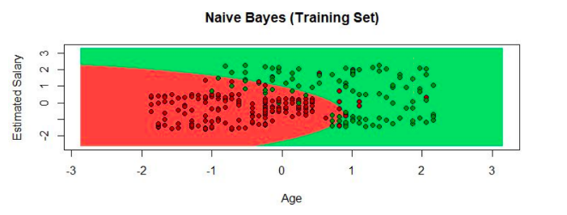
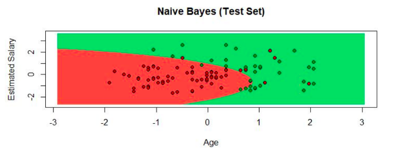

# Unit 3 Evaluation

**Introduction**

In this practice we proceed to explain the code of evaluative practice for unit 3.

**Instructions**

Develop the following problem with R and RStudio to extract the knowledge that the problem requires.

Implement the Naive Bayes classification model with the Social_Network_Ads.csv data set and using the e1071 library with the naiveBayes () function. Once the classifier is obtained, do the corresponding data visualization analysis.

At the end of the development explain in detail what the Naive Bayes classification model consists of and also the detailed explanation corresponding to data visualization.

**Naive Bayes model**

Naive Bayes is a special kind of Machine Learning classification algorithm. It is based on a statistical classification technique called
Bayes theorem.
In this algorithm it is assumed that the predictor variables are independent of each other, which means that the presence of a certain characteristic in a data set is not at all related to the presence of any other characteristic that could be had.
In other words, this type of algorithm treats its variables separately, completely ignoring any relationship rule that may exist between variables, for example, a certain logical order, a certain structure, some special characteristic, etc. In short, each variable is independent.
The Naive Bayes algorithm is used to build models with very good behaviors. It is done in an easier way due to the simplicity of it.
The algorithm does this by providing a way of calculating the posterior probability of a certain event A occurring, given some probabilities of prior events. Naive Bayes is easy to build and particularly useful for very large data sets.

**Development**

1.- Command to place ourselves on the route on which we will work.
```r
setwd("C:/Users/rebec/Clase_Datos/Data_Mining/Evaluation")
```

2.- Import of the dataset
```r
dataset <- read.csv('Social_Network_Ads.csv')
dataset = dataset[3:5]
```

3.- We create a new dataset with the data of the columns that interest us.
```r
dataset$Purchased = factor(dataset$Purchased, levels = c(0,1) )
```

4.- Install packages('caTools').
```r
library(caTools)
```

5.- We divide the dataset into the training set and the test set.
```r
set.seed(123)
split = sample.split(dataset$Purchased, SplitRatio =0.75)
training_set = subset(dataset, split == TRUE)
test_set = subset(dataset, split == FALSE)
```

6.- Scaling features.
```r
training_set[-3]= scale(training_set[-3])
test_set[-3]= scale(test_set[-3])
```

7.- Install packages('e1071').
```r
library(e1071)
```

8.- Adjustment of logistic regression to the training set.
```r
classifier = naiveBayes(formula = Purchased ~ .,
                data=training_set,
                type='C-Classification',
                kernel='linear')

naiveBayes
```

9.- Prediction of the results of the test suite.
```r
y_pred = predict(classifier, newdata = test_set[-3])
y_pred
```

10.- We do the confusion matrix.
```r
cm = table(test_set[, 3], y_pred)
cm
```

11.- We load the "ElemStatLearn" library.
```r
library(ElemStatLearn)
```

12.- Here we use the training_set data, with these we create two sequences, we use the grid_set with which we compare the sequences, we add the columns of "Age" and "EstimatedSalary" to create a vector. With the y_grid we use the prediction we created earlier. With the chart design we add the title with the main, we determine the axes "x" and "y" and their respective names. We determine the points that will be displayed on the chart and the color of each, in this case if they bought they will be green and those that did not buy will be in red.
```r
set = training_set
x1= seq(min(set[, 1]) -1, max(set[, 1]) + 1, by=0.01)
x2= seq(min(set[, 2]) -1, max(set[, 2]) + 1, by=0.01)
grid_set = expand.grid(x1,x2)
colnames(grid_set) = c('Age', 'EstimatedSalary')
y_grid = predict(classifier, newdata = grid_set)
plot(set[, -3],
      main = 'Naive Bayes (Training Set)',
      xlab = 'Age', ylab = 'Estimated Salary',
      xlim = range(x1), ylim = range(x2))
contour(x1,x2, matrix(as.numeric(y_grid), length(x1),length(x2)), add = TRUE)
points(grid_set, pch = '.', col = ifelse(y_grid ==1, 'springgreen3', 'tomato'))
points(set, pch =21, bg = ifelse(set[, 3] == 1, 'green4', 'red3'))
```
The graph is this:



13.- Visualization of the results of the test suite with the above procedure, using the data of test_set.
```r
library(ElemStatLearn)
set = test_set
x1= seq(min(set[, 1]) -1, max(set[, 1]) + 1, by=0.01)
x2= seq(min(set[, 2]) -1, max(set[, 2]) + 1, by=0.01)
grid_set = expand.grid(x1,x2)
colnames(grid_set) = c('Age', 'EstimatedSalary')
y_grid = predict(classifier, newdata = grid_set)
plot(set[, -3],
      main = 'Naive Bayes (Test Set)',
      xlab = 'Age', ylab = 'Estimated Salary',
      xlim = range(x1), ylim = range(x2))
contour(x1,x2, matrix(as.numeric(y_grid), length(x1),length(x2)), add = TRUE)
points(grid_set, pch = '.', col = ifelse(y_grid ==1, 'springgreen3', 'tomato'))
points(set, pch =21, bg = ifelse(set[, 3] == 1, 'green4', 'red3'))
```
The graph is this:

