# Practice 1 Simple Linear Regression

Command to place ourselves on the route on which we will work
```r
getwd()
setwd("C/:")
```

Importing the dataset
```r
dataset <- read.csv('Salary_Data.csv')
```

Install.packages('caTools')
Splitting the dataset into the Training set and Test set
```r
library(caTools)
set.seed(123)
split <- sample.split(dataset$Salary, SplitRatio = 2/3)
training_set <- subset(dataset, split == TRUE)
test_set <- subset(dataset, split == FALSE)
```

Fitting Simple Linear Regression to the Training set
```r
regressor = lm(formula = Salary ~ YearsExperience,
               data = dataset)
summary(regressor)
```

Predicting the Test set results
```r
y_pred = predict(regressor, newdata = test_set)
```

Visualising the Training set results
```r
library(ggplot2)
ggplot() +
  geom_point(aes(x=training_set$YearsExperience, y=training_set$Salary),
             color = 'red') +
  geom_line(aes(x = training_set$YearsExperience, y = predict(regressor, newdata = training_set)),
            color = 'blue') +
  ggtitle('Salary vs Experience (Training Set)') +
  xlab('Years of experience') +
  ylab('Salary')
```
Graph obtained :


Visualising the Test set results
```r
ggplot() +
  geom_point(aes(x=test_set$YearsExperience, y=test_set$Salary),
             color = 'red') +
  geom_line(aes(x = training_set$YearsExperience, y = predict(regressor, newdata = training_set)),
            color = 'blue') +
  ggtitle('Salary vs Experience (Test Set)') +
  xlab('Years of experience') +
  ylab('Salary')
```
Graph obtained:

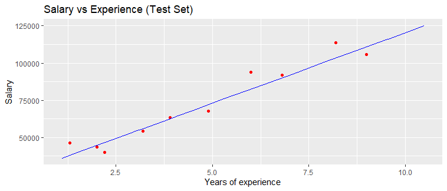


# Practice 2 Multiple Linear Regression

Command to place ourselves on the route on which we will work
```r
getwd()
setwd("")
```

Importing the dataset
```r
dataset <- read.csv('50_Startups.csv')
```

Encoding categorical data
```r 
dataset$State = factor(dataset$State,
                       levels = c('New York', 'California', 'Florida'),
                       labels = c(1,2,3))

dataset
```

Install.packages('caTools')
Splitting the dataset into the Training set and Test set
```r
library(caTools)
set.seed(123)
split <- sample.split(dataset$Profit, SplitRatio = 0.8)
training_set <- subset(dataset, split == TRUE)
test_set <- subset(dataset, split == FALSE)
```

Fitting Multiple Linear Regression to the Training set
regressor = lm(formula = Profit ~ R.D.Spend + Administration + Marketing.Spend + State)
```r
regressor = lm(formula = Profit ~ .,
               data = training_set )

summary(regressor)
```

Prediction the Test set results
```r
y_pred = predict(regressor, newdata = test_set)
y_pred
```

Building the optimal model using Backward Elimination
```r
regressor = lm(formula = Profit ~ R.D.Spend + Administration + Marketing.Spend + State,
               data = dataset )
summary(regressor)

regressor = lm(formula = Profit ~ R.D.Spend + Administration + Marketing.Spend,
               data = dataset )
summary(regressor)

regressor = lm(formula = Profit ~ R.D.Spend + Marketing.Spend,
               data = dataset )
summary(regressor)

regressor = lm(formula = Profit ~ R.D.Spend + Marketing.Spend,
               data = dataset )
summary(regressor)

y_pred = predict(regressor, newdata = test_set)
y_pred
```

Homework analise the follow atomation backwardElimination function 
```r
backwardElimination <- function(x, sl) {
  numVars = length(x)
  for (i in c(1:numVars)){
    regressor = lm(formula = Profit ~ ., data = x)
    maxVar = max(coef(summary(regressor))[c(2:numVars), "Pr(>|t|)"])
    if (maxVar > sl){
      j = which(coef(summary(regressor))[c(2:numVars), "Pr(>|t|)"] == maxVar)
      x = x[, -j]
    }
    numVars = numVars - 1
  }
  return(summary(regressor))
}

SL = 0.05
```

dataset = dataset[, c(1,2,3,4,5)]
```r
training_set
backwardElimination(training_set, SL)
```


# Practice 3 Logistic Regression


Command to place ourselves on the route on which we will work
```r
getwd()
setwd("")
```
Importing the dataset
```r
dataset <- read.csv('Social_Network_Ads.csv')
dataset <- dataset[, 3:5]
```
Install.packages('caTools')
Splitting the dataset into the Training set and Test set

```r
library(caTools)
set.seed(123)
split <- sample.split(dataset$Purchased, SplitRatio = 0.75)
training_set <- subset(dataset, split == TRUE)
test_set <- subset(dataset, split == FALSE)
```
Feature scaling
```r
training_set[, 1:2] <- scale(training_set[, 1:2])
test_set[, 1:2] <- scale(test_set[, 1:2])
```
Fitting Logistic Regression to Training set
```r
classifier = glm(formula = Purchased ~ .,
                 family = binomial,
                 data = training_set)
```
Predicting the Test set results
```r
prob_pred = predict(classifier, type = 'response', newdata = test_set[-3])
prob_pred
y_pred = ifelse(prob_pred > 0.5, 1, 0)
y_pred
```
Making the Confusion Metrix
```r
cm = table(test_set[, 3], y_pred)
cm
```
We load the "ggplot" library for the visualization of the data
```r
library(ggplot2)
ggplot(training_set, aes(x=EstimatedSalary, y=Purchased)) + geom_point() + 
  stat_smooth(method="glm", method.args=list(family="binomial"), se=FALSE)

ggplot(training_set, aes(x=Age, y=Purchased)) + geom_point() + 
  stat_smooth(method="glm", method.args=list(family="binomial"), se=FALSE)

ggplot(test_set, aes(x=EstimatedSalary, y=Purchased)) + geom_point() + 
  stat_smooth(method="glm", method.args=list(family="binomial"), se=FALSE)

ggplot(test_set, aes(x=Age, y=Purchased)) + geom_point() + 
  stat_smooth(method="glm", method.args=list(family="binomial"), se=FALSE)
```
install.packages('ElemStatLearn') 
Visualization the Training set result
```r
library(ElemStatLearn)
set = training_set
X1 = seq(min(set[, 1]) - 1, max(set[, 1]) + 1, by = 0.01)
X2 = seq(min(set[, 2]) - 1, max(set[, 2]) + 1, by = 0.01)
grid_set = expand.grid(X1, X2)
colnames(grid_set) = c('Age', 'EstimatedSalary')
prob_set = predict(classifier, type = 'response', newdata = grid_set)
y_grid = ifelse(prob_set > 0.5, 1, 0)
plot(set[, -3],
     main = 'Logistic Regression (Training set)',
     xlab = 'Age', ylab = 'Estimated Salary',
     xlim = range(X1), ylim = range(X2))
contour(X1, X2, matrix(as.numeric(y_grid), length(X1), length(X2)), add = TRUE)
points(grid_set, pch = '.', col = ifelse(y_grid == 1, 'springgreen3', 'tomato'))
points(set, pch = 21, bg = ifelse(set[, 3] == 1, 'green4', 'red3'))
```

Graph obtained :

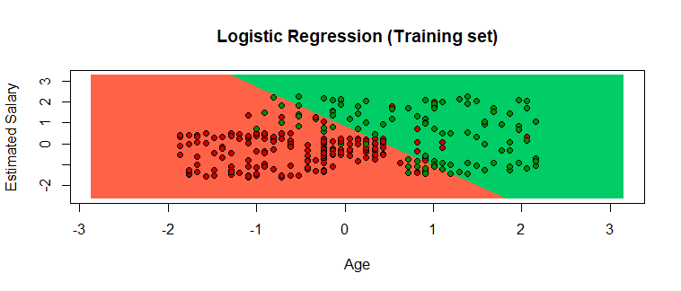

Visualising the Test set results
```r
library(ElemStatLearn)
set = test_set
X1 = seq(min(set[, 1]) - 1, max(set[, 1]) + 1, by = 0.01)
X2 = seq(min(set[, 2]) - 1, max(set[, 2]) + 1, by = 0.01)
grid_set = expand.grid(X1, X2)
colnames(grid_set) = c('Age', 'EstimatedSalary')
prob_set = predict(classifier, type = 'response', newdata = grid_set)
y_grid = ifelse(prob_set > 0.5, 1, 0)
plot(set[, -3],
     main = 'Logistic Regression (Test set)',
     xlab = 'Age', ylab = 'Estimated Salary',
     xlim = range(X1), ylim = range(X2))
contour(X1, X2, matrix(as.numeric(y_grid), length(X1), length(X2)), add = TRUE)
points(grid_set, pch = '.', col = ifelse(y_grid == 1, 'springgreen3', 'tomato'))
points(set, pch = 21, bg = ifelse(set[, 3] == 1, 'green4', 'red3'))
```

Graph obtained :

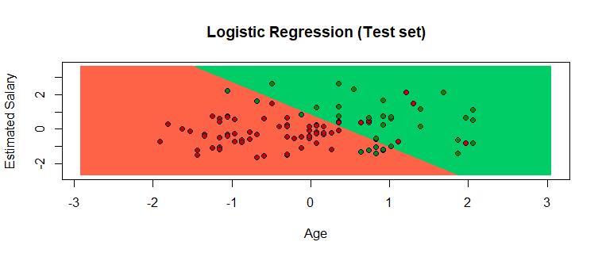


# Practice 4 Decision trees

We verify the current directory path with the getwd and configure the path to the working directory in case it is not the desired one.
```r
getwd()
setwd("C:/Users/Downloads/DataMining-
master/MachineLearning/DesicionThree")
getwd()
```

The dataset from the csv file is imported
```r
dataset = read.csv('Social_Network_Ads.csv')
dataset = dataset[3:5]
```

Encoding the target function as a factor classify values as true and false
```r
dataset$Purchased = factor(dataset$Purchased, levels = c(0, 1))
```

We install the caTools library
```r
library(caTools)
```

Split the dataset into the training_set and the test_set
```r
set.seed(123)
split = sample.split(dataset$Purchased, SplitRatio = 0.75)
training_set = subset(dataset, split == TRUE)
test_set = subset(dataset, split == FALSE)
```

Function scale
```r
training_set[-3] = scale(training_set[-3])
test_set[-3] = scale(test_set[-3])
```

Adaptation of the decision tree classification to the training_set
```r
library(rpart)
classifier = rpart(formula = Purchased ~ .,
data = training_set)
```

Predict the results of the training_set
```r
y_pred = predict(classifier, newdata = test_set[-3], type = 'class')
y_pred
```

We make the Confusion Matrix
```r
cm = table(test_set[, 3], y_pred)
cm
```

Viewing the training_set results
```r
library(ElemStatLearn)
set = training_set
X1 = seq(min(set[, 1]) - 1, max(set[, 1]) + 1, by = 0.01)
X2 = seq(min(set[, 2]) - 1, max(set[, 2]) + 1, by = 0.01)
grid_set = expand.grid(X1, X2)
colnames(grid_set) = c('Age', 'EstimatedSalary')
y_grid = predict(classifier, newdata = grid_set, type = 'class')
plot(set[, -3],
main ='Decision Tree Classification (Training set)',
xlab = 'Age', ylab = 'Estimated Salary',
xlim = range(X1), ylim = range(X2))
contour(X1, X2, matrix(as.numeric(y_grid), length(X1), length(X2)), add
= TRUE)
points(grid_set, pch = '.', col = ifelse(y_grid == 1, 'springgreen3',
'tomato'))
points(set, pch = 21, bg = ifelse(set[, 3] == 1, 'green4', 'red3'))
```

The graph is this:

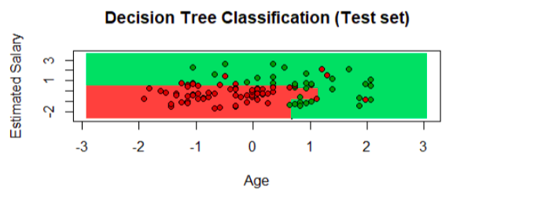


# Practice 5 K-mens

Importing the dataset
```r
dataset = read.csv('Mall_Customers.csv')
dataset = dataset[4:5]
```
Command to place ourselves on the route on which we will work
```r
getwd()
setwd("")
```
Using the elbow method to find the optimal number of clusters
```r
set.seed(6)
wcss = vector()
for (i in 1:10) wcss[i] = sum(kmeans(dataset, i)$withinss)
plot(1:10,
     wcss,
     type = 'b',
     main = paste('The Elbow Method'),
     xlab = 'Number of clusters',
     ylab = 'WCSS')
```
Fitting K-Means to the dataset
```r
set.seed(29)
kmeans = kmeans(x = dataset, centers = 5)
y_kmeans = kmeans$cluster
```
Graph obtained :

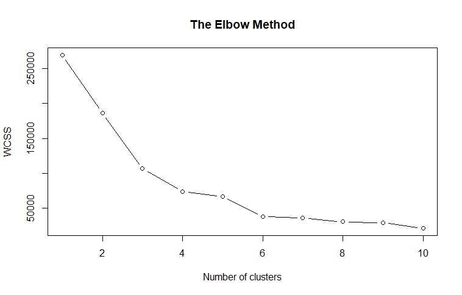

install.packages('cluster')
Visualising the clusters
```r
library(cluster)
clusplot(dataset,
         y_kmeans,
         lines = 0,
         shade = TRUE,
         color = TRUE,
         labels = 2,
         plotchar = FALSE,
         span = TRUE,
         main = paste('Clusters of customers'),
         xlab = 'Annual Income',
         ylab = 'Spending Score')
```        
Graph obtained :

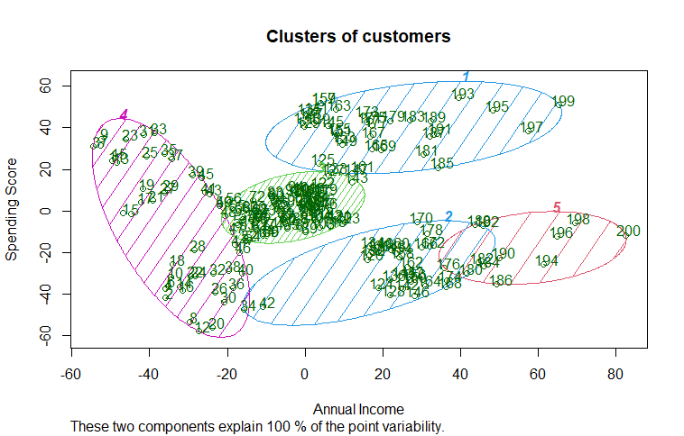

# Practice 6 KNN

We verify the path in which we are going to work, then we load the file "Social_Network_Ads.csv" and mark the dataset in [3: 5] to work with the data from column 3 to 5
```r
setwd("C:/Users/Downloads/DataMining-master/MachineLearning/KNN")
dataset = read.csv('Social_Network_Ads.csv')
dataset = dataset[3:5]
```

In the Purchased column we work with the true and false values
```r
dataset$Purchased = factor(dataset$Purchased, levels = c(0, 1))
```

We install the caTools library
```r
library(caTools)
```

We load the CaTools library and tell it to use the TRUE values in the training_set and the FALSE values in the 
```r
test_set
set.seed(123)
split = sample.split(dataset$Purchased, SplitRatio = 0.75)
training_set = subset(dataset, split == TRUE)
test_set = subset(dataset, split == FALSE)
```

We use the Scale function with which what we do is center the values of an array and scale them
```r
training_set[-3] = scale(training_set[-3])
test_set[-3] = scale(test_set[-3])
```

We load the class library to be able to classify the values of training_set and test_set
```r
library(class)
y_pred = knn(train = training_set[, -3],
test = test_set[, -3],
cl = training_set[, 3],
k = 5,
prob = TRUE)
```

We create the confusion matrix with the table function, which we will give test_set showing 3 columns and we give it y_pred
```r
cm = table(test_set[, 3], y_pred)
```

Now we install ElemStatLearn, in my case I had problems with the version, so we occupy the following command, with X1 and X2 we set the minimum and maximum parameters, we configure the graphing, for example we use y_grid as y axis
We visualize the training set and test set graphs.
```r
install_version('ElemStatLearn', version = '4.0')
library(ElemStatLearn)
set = training_set
X1 = seq(min(set[, 1]) - 1, max(set[, 1]) + 1, by = 0.01)
X2 = seq(min(set[, 2]) - 1, max(set[, 2]) + 1, by = 0.01)
grid_set = expand.grid(X1, X2)
colnames(grid_set) = c('Age', 'EstimatedSalary')
y_grid = knn(train = training_set[, -3], test = grid_set, cl =
training_set[, 3], k = 5)
plot(set[, -3],
main = 'K-NN (Training set)',
xlab = 'Age', ylab = 'Estimated Salary',
xlim = range(X1), ylim = range(X2))
contour(X1, X2, matrix(as.numeric(y_grid), length(X1), length(X2)), add
= TRUE)
points(grid_set, pch = '.', col = ifelse(y_grid == 1, 'springgreen3',
'tomato'))
points(set, pch = 21, bg = ifelse(set[, 3] == 1, 'green4', 'red3'))
```

```r
library(ElemStatLearn)
set = test_set
X1 = seq(min(set[, 1]) - 1, max(set[, 1]) + 1, by = 0.01)
X2 = seq(min(set[, 2]) - 1, max(set[, 2]) + 1, by = 0.01)
grid_set = expand.grid(X1, X2)
colnames(grid_set) = c('Age', 'EstimatedSalary')
y_grid = knn(train = training_set[, -3], test = grid_set, cl =
training_set[, 3], k = 5)
plot(set[, -3],
main = 'K-NN (Test set)',
xlab = 'Age', ylab = 'Estimated Salary',
xlim = range(X1), ylim = range(X2))
contour(X1, X2, matrix(as.numeric(y_grid), length(X1), length(X2)), add
= TRUE)
points(grid_set, pch = '.', col = ifelse(y_grid == 1, 'springgreen3',
'tomato'))
points(set, pch = 21, bg = ifelse(set[, 3] == 1, 'green4', 'red3'))
```
These are the graphs:

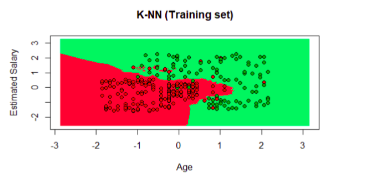

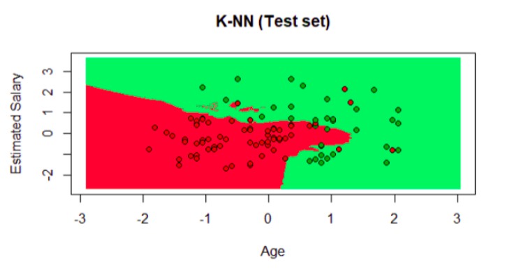

# Practice 7 Random Forest

We check the current directory path with getwd and set it to the working directory in case it is not the desired one
```r
getwd()
setwd("C:/Users/Downloads/DataMining-
master/MachineLearning/RandomForest")
getwd()
```

We import the dataset
```r
dataset = read.csv('Social_Network_Ads.csv')
dataset = dataset[3:5]
```

Encoding the target function as a factor
```r
dataset$Purchased = factor(dataset$Purchased, levels = c(0, 1))
```

We install the caTools library
```r
library(caTools)
```

We divide the data set into the training set (training_set) and the test set (test_set) where training is a true value and test is a false value
```r
set.seed(123)
split = sample.split(dataset$Purchased, SplitRatio = 0.75)
training_set = subset(dataset, split == TRUE)
test_set = subset(dataset, split == FALSE)
```

Function scale
```r
training_set[-3] = scale(training_set[-3])
test_set[-3] = scale(test_set[-3])
```

Adaptation of the random classification of forests to the training set
```r
library(randomForest)
set.seed(123)
classifier = randomForest(x = training_set[-3],
y = training_set$Purchased,
ntree =10)
```

We predict the results of the test set
```r
y_pred = predict(classifier, newdata = test_set[-3])
y_pred
```

We establish the Confusion Matrix
```r
cm = table(test_set[, 3], y_pred)
cm
```

Viewing training_set results
```r
library(ElemStatLearn)
set = training_set
X1 = seq(min(set[, 1]) - 1, max(set[, 1]) + 1, by = 0.01)
X2 = seq(min(set[, 2]) - 1, max(set[, 2]) + 1, by = 0.01)
grid_set = expand.grid(X1, X2)
colnames(grid_set) = c('Age', 'EstimatedSalary')
y_grid = predict(classifier, grid_set)
plot(set[, -3],
main = 'Random Forest Classification (Training set)',
xlab = 'Age', ylab = 'Estimated Salary',
xlim = range(X1), ylim = range(X2))
contour(X1, X2, matrix(as.numeric(y_grid), length(X1), length(X2)), add
= TRUE)
points(grid_set, pch = '.', col = ifelse(y_grid == 1, 'springgreen3',
'tomato'))
points(set, pch = 21, bg = ifelse(set[, 3] == 1, 'green4', 'red3'))
```

The graph is this:

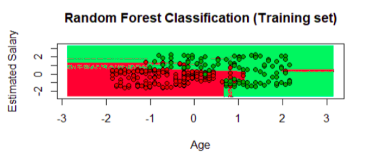

Viewing the results of test_set
```r
library(ElemStatLearn)
set = test_set
X1 = seq(min(set[, 1]) - 1, max(set[, 1]) + 1, by = 0.01)
X2 = seq(min(set[, 2]) - 1, max(set[, 2]) + 1, by = 0.01)
grid_set = expand.grid(X1, X2)
colnames(grid_set) = c('Age', 'EstimatedSalary')
y_grid = predict(classifier, grid_set)
plot(set[, -3], main = 'Random Forest Classification (Test set)',
xlab = 'Age', ylab = 'Estimated Salary',
xlim = range(X1), ylim = range(X2))
contour(X1, X2, matrix(as.numeric(y_grid), length(X1), length(X2)), add
= TRUE)
points(grid_set, pch = '.', col = ifelse(y_grid == 1, 'springgreen3',
'tomato'))
points(set, pch = 21, bg = ifelse(set[, 3] == 1, 'green4', 'red3'))
```

The graph is this:

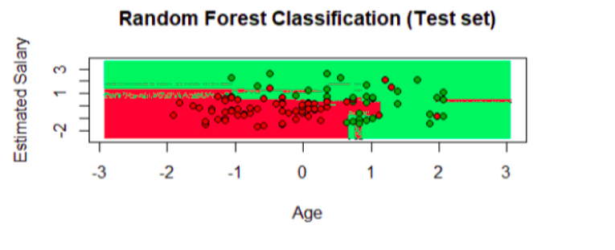

# Practice 8 SVM

We verify the current directory path with getwd and configure the path to the working directory in case it is not the desired one
```r
getwd()
setwd("/home/chris/Documents/itt/Enero_Junio_2020/Mineria_de_datos/Data
Mining/MachineLearning/SVM")
getwd()
```

We import the dataset from the .csv file
```r
dataset = read.csv('Social_Network_Ads.csv')
dataset = dataset[3:5]
```

Encoding the target function as a factor, we classify values as true and false
```r
dataset$Purchased = factor(dataset$Purchased, levels = c(0, 1))
```

We install the caTools library
```r
library(caTools)
```

Split the data set into the training set and the test_set
```r
set.seed(123)
split = sample.split(dataset$Purchased, SplitRatio = 0.75)
training_set = subset(dataset, split == TRUE)
test_set = subset(dataset, split == FALSE)
```

We carry out a scaling of training and test functions
```r
training_set[-3] = scale(training_set[-3])
test_set[-3] = scale(test_set[-3])
```

Adaptation of SVM method to test set
```r
library(e1071)
classifier = svm(formula = Purchased ~ .,
data = training_set,
type = 'C-classification',
kernel = 'linear')
svm
```

We predict the results of the test set data set
```r
y_pred = predict(classifier, newdata = test_set[-3])
y_pred
```

Making the Confusion Matrix
```r
cm = table(test_set[, 3], y_pred)
cm
```

Viewing the training_set results
```r
library(ElemStatLearn)
set = training_set
X1 = seq(min(set[, 1]) - 1, max(set[, 1]) + 1, by = 0.01)
X2 = seq(min(set[, 2]) - 1, max(set[, 2]) + 1, by = 0.01)
grid_set = expand.grid(X1, X2)
colnames(grid_set) = c('Age', 'EstimatedSalary')
y_grid = predict(classifier, newdata = grid_set)
plot(set[, -3],
main = 'SVM (Training set)',
xlab = 'Age', ylab = 'Estimated Salary',
xlim = range(X1), ylim = range(X2))
contour(X1, X2, matrix(as.numeric(y_grid), length(X1), length(X2)), add
= TRUE)
points(grid_set, pch = '.', col = ifelse(y_grid == 1, 'springgreen3',
'tomato'))
points(set, pch = 21, bg = ifelse(set[, 3] == 1, 'green4', 'red3'))
```

The graph is this:

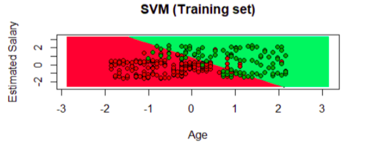

Viewing the results of the test_set
```r
library(ElemStatLearn)
set = test_set
X1 = seq(min(set[, 1]) - 1, max(set[, 1]) + 1, by = 0.01)
X2 = seq(min(set[, 2]) - 1, max(set[, 2]) + 1, by = 0.01)
grid_set = expand.grid(X1, X2)
colnames(grid_set) = c('Age', 'EstimatedSalary')
y_grid = predict(classifier, newdata = grid_set)
plot(set[, -3], main = 'SVM (Test set)',
xlab = 'Age', ylab = 'Estimated Salary',
xlim = range(X1), ylim = range(X2))
contour(X1, X2, matrix(as.numeric(y_grid), length(X1), length(X2)), add
= TRUE)
points(grid_set, pch = '.', col = ifelse(y_grid == 1, 'springgreen3',
'tomato'))
points(set, pch = 21, bg = ifelse(set[, 3] == 1, 'green4', 'red3'))
```

The graph is this:

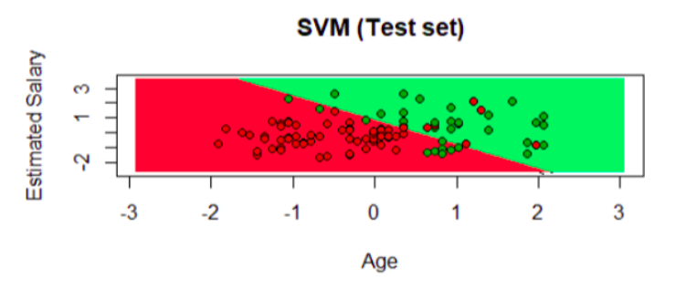