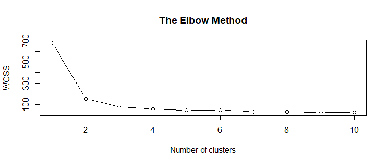
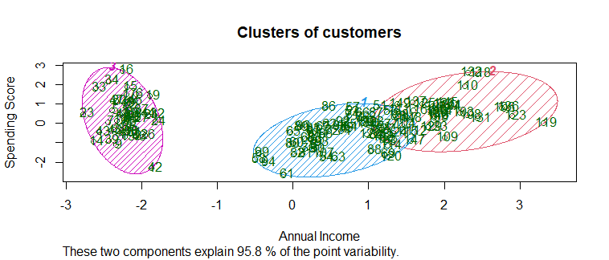

# Unit 4 evaluation practice

**Introduction**

In this practice we proceed to explain the code of our evaluative practice for unit 4.

**Development**

1.- Set our workspace
```r
getwd()
setwd("")
```

2.- Importing the dataset
```r
dataset = read.csv('iris.csv')
dataset = dataset[1:4]
```

3.- Using the elbow method to find the optimal number of clusters
```r
set.seed(6)
wcss = vector()
for (i in 1:10) wcss[i] = sum(kmeans(dataset, i)$withinss)
plot(1:10,
     wcss,
     type = 'b',
     main = paste('The Elbow Method'),
     xlab = 'Number of clusters',
     ylab = 'WCSS')
```

Graph obtained:



4.- Fitting K-Means to the dataset
```r
set.seed(29)
kmeans = kmeans(x = dataset, centers = 3)
y_kmeans = kmeans$cluster
```

5.- We load the previously installed "cluster" library
```r
library(cluster)
```

6.- Visualising the clusters
```r
clusplot(dataset,
         y_kmeans,
         lines = 0,
         shade = TRUE,
         color = TRUE,
         labels = 2,
         plotchar = FALSE,
         span = TRUE,
         main = paste('Clusters of customers'),
         xlab = 'Annual Income',
         ylab = 'Spending Score')
```

Graph obtained:

